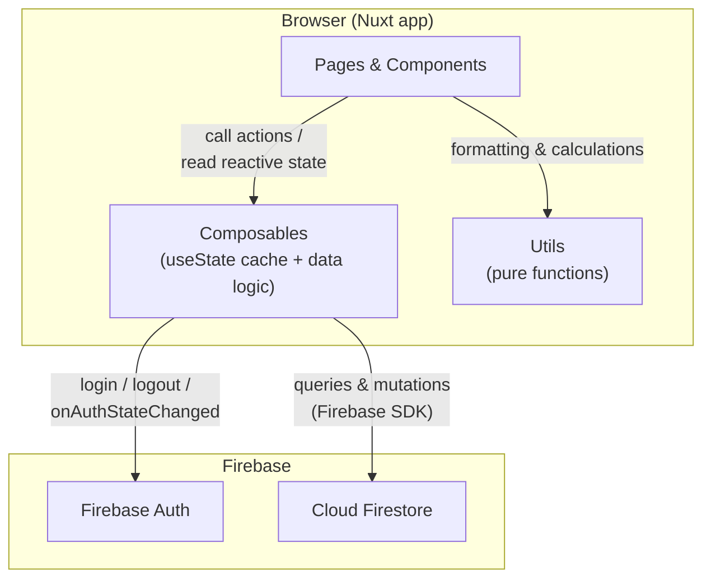
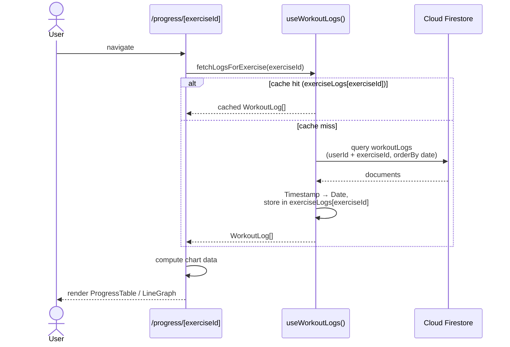
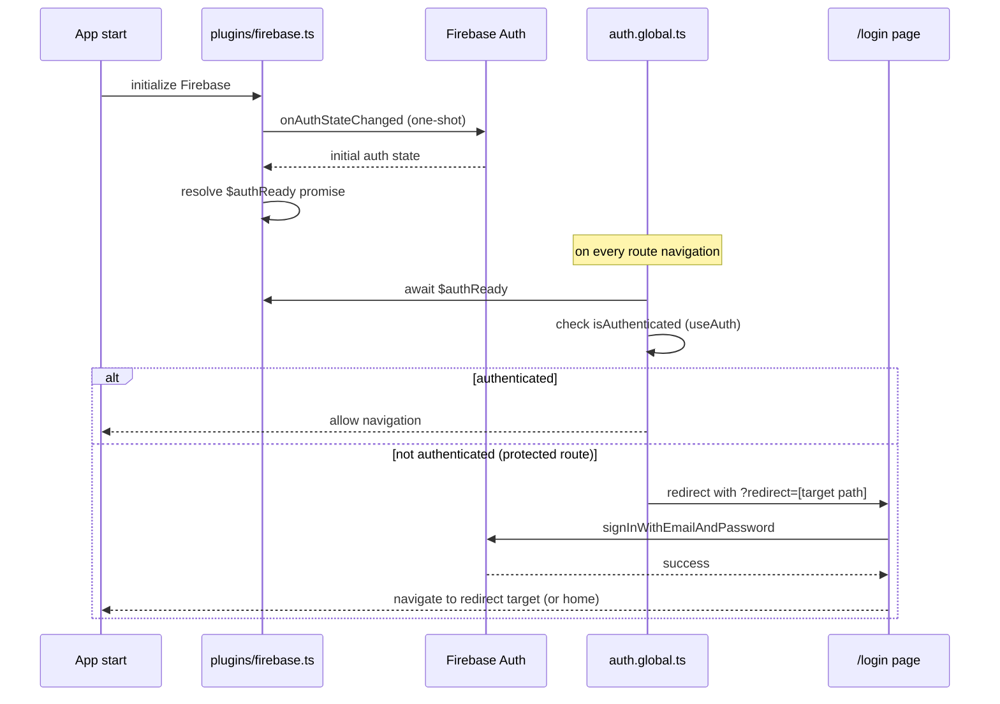

# Architecture Documentation

## Overview

Fitness Progress App is built with modern web technologies following Vue 3 Composition API patterns and Nuxt 4 conventions. The architecture emphasizes type safety, code reusability, and clear separation of concerns.

## Tech Stack

- **Framework:** Nuxt 4
- **UI Library:** Vue 3 (Composition API)
- **Styling:** Tailwind CSS
- **Backend:** Firebase (Firestore + Authentication)
- **Language:** TypeScript
- **Charts:** Chart.js + vue-chartjs
- **Package Manager:** npm/pnpm/yarn/bun

## Project Structure

```
app/
├── components/          # Vue components
│   ├── common/         # Shared layout components
│   │   ├── BaseFooter.vue
│   │   ├── BaseHeader.vue
│   │   └── BasePage.vue
│   ├── exercises/      # Exercise-specific components
│   ├── icons/          # SVG icon components
│   │   └── common/     # Common icons
│   ├── modals/         # Modal dialogs
│   ├── progress/       # Progress tracking components
│   │   ├── LineGraph.vue
│   │   ├── ProgressGraph.vue
│   │   └── ProgressTable.vue
│   └── ui/             # Reusable UI components
│       └── navigation/ # Navigation components
│           ├── BackLink.vue
│           └── BaseTabs.vue
├── composables/        # Vue composables (state management)
│   ├── useAuth.ts
│   ├── useExercises.ts
│   ├── useProgress.ts
│   └── useWorkoutLog.ts
├── constants/          # Application constants
│   └── routes.ts       # Route names and path builders
├── middleware/         # Nuxt middleware
│   └── auth.global.ts  # Global authentication middleware
├── pages/              # File-based routing
│   ├── exercises/
│   │   ├── [id].vue
│   │   └── index.vue
│   ├── progress/
│   │   ├── [exerciseId].vue  # Exercise-specific progress page
│   │   └── index.vue          # Progress overview
│   ├── workouts/
│   │   ├── [id]/
│   │   │   ├── add.vue
│   │   │   ├── index.vue
│   │   │   └── log/
│   │   │       └── [exerciseId].vue
│   │   └── index.vue
│   ├── contact.vue
│   ├── index.vue
│   └── login.vue
├── plugins/            # Nuxt plugins
│   └── firebase.ts
├── types/              # TypeScript type definitions
│   └── index.ts
└── utils/              # Utility functions
    ├── date.ts         # Date formatting utilities
    └── workout.ts      # Workout calculation utilities
```

## Core Concepts

### 1. Composables Pattern

Composables are reusable stateful logic functions following Vue 3 Composition API patterns. They manage:
- State with `useState` (Nuxt's SSR-safe state management)
- API calls to Firebase
- Data transformations
- Caching strategies

**Example: `useWorkoutLog.ts`**
```typescript
export const useWorkoutLogs = () => {
  const logs = useState<WorkoutLog[]>('workoutLogs', () => []);
  const exerciseLogs = useState<Record<string, WorkoutLog[]>>('exerciseWorkoutLogs', () => ({}));

  const fetchLogsForExercise = async (exerciseId: string, force = false): Promise<WorkoutLog[]> => {
    // Caching logic
    if (exerciseLogs.value[exerciseId] && !force) {
      return exerciseLogs.value[exerciseId];
    }
    // Fetch and cache
  };

  return { logs, fetchLogsForExercise, ... };
};
```

### 2. Component Architecture

#### Layout Components
- `BasePage.vue` - Standard page wrapper with header, icon slot, and navigation slot
- `BaseHeader.vue` - Navigation bar with authentication state
- `BaseFooter.vue` - Footer with links

#### Feature Components
Components are organized by feature domain:
- **exercises/** - Exercise browsing and management
- **progress/** - Progress tracking, tables, and graphs
- **workouts/** - Workout logging and session management
- **ui/** - Reusable UI components (tabs, navigation, buttons, etc.)

### 3. Type System

All data structures are defined in `types/index.ts`:

```typescript
export interface WorkoutLog {
  id: string;
  userId: string;
  sessionId: string;
  exerciseId: string;
  exerciseName: string;
  sets: Set[];
  date: Date;
  notes?: string;
}

export interface Set {
  reps: number;
  weight: number;
}
```

### 4. Routing

File-based routing with dynamic routes:
- `/exercises` - List all exercises
- `/exercises/[id]` - Exercise details
- `/progress` - Personal records overview
- `/progress/[exerciseId]` - Detailed progress for specific exercise
- `/workouts` - Workout sessions list
- `/workouts/[id]` - Workout session details
- `/workouts/[id]/log/[exerciseId]` - Log exercise in session

Route constants and builders in `constants/routes.ts`:
```typescript
export const ROUTE_NAMES = {
  PROGRESS_EXERCISE: 'progress-exerciseId',
  // ...
};

export const buildRoute = {
  progressExercise: (exerciseId: string) => ({
    name: ROUTE_NAMES.PROGRESS_EXERCISE,
    params: { exerciseId },
  })
};
```

### 5. State Management

**Global State:** Nuxt's `useState` composable provides SSR-safe global state

**Caching Strategy:**
- Exercise data cached in `exercises` array
- Workout logs cached per session in `currentSessionId`
- Exercise-specific logs cached in `exerciseLogs` Record (key: exerciseId)
- Cache invalidation via `force` parameter
- State cleared on logout for security

### 6. Utility Functions

Pure functions for common operations:

**`utils/date.ts`**
- `formatDateShort(date)` - Returns "DD.MM.YY" format
- `formatDateLong(date)` - Returns "Month Day, Year" format

**`utils/workout.ts`**
- `calculateMaxWeight(sets)` - Finds maximum weight across sets
- `calculateVolume(sets)` - Calculates total volume (sum of reps × weight)
- `formatBestSet(sets)` - Returns best set as "reps×weight" string
- `findBestSet(sets)` - Finds set with highest weight

### 7. Data Flow



Components never talk to Firebase directly — all reads/writes go through a composable, which caches results in `useState` so repeated visits don't re-query Firestore.

**Example: Loading Exercise Progress**



The Firestore data model behind these flows (collections, fields, relationships) is documented in [DATA_MODEL.md](DATA_MODEL.md).

## Features Architecture

### Progress Tracking System

**Components:**
1. **ProgressTable** - Tabular view of workout history
2. **ProgressGraph** - Parent component managing data fetching
3. **LineGraph** - Reusable Chart.js wrapper

**Data Flow:**
```
/progress/[exerciseId] page
    ↓
ProgressGraph component
    ├─ Fetches logs via fetchLogsForExercise()
    ├─ Transforms data into chart format
    ├─ Computes labels, max weights, volumes
    └─ Passes to child components
        ├─ ProgressTable (when "Table" tab active)
        └─ LineGraph × 2 (when "Graph" tab active)
            ├─ Max Weight Progress
            └─ Total Volume Progress
```

**Key Features:**
- Dynamic table columns based on max sets performed
- Highlighting of highest volume workout
- Responsive charts with dynamic sizing
- Horizontal scrolling for large datasets
- Cached data fetching

### Authentication Flow

**Middleware:** `auth.global.ts` protects all routes except login



**Logout Security:**
- All composables expose `clearState()` functions
- Called on logout to prevent data leakage
- Clears: exercises, workout logs, progress data, session info

## Performance Optimizations

1. **Caching:**
   - Exercise list cached globally
   - Workout logs cached per session and per exercise
   - Prevents redundant Firebase queries

2. **Computed Properties:**
   - Chart data computed reactively from cached state
   - Only recalculates when dependencies change

3. **Dynamic Loading:**
   - Components lazy-loaded via Nuxt auto-imports
   - Charts only loaded when graph tab is active

4. **Firebase Query Optimization:**
   - Indexed queries (userId + exerciseId, userId + sessionId)
   - Ordered results from database (orderBy 'date')
   - Limited results where appropriate

## Security

1. **Authentication Middleware:**
   - Global middleware protects all routes
   - Only /login accessible without authentication

2. **Firestore Security:**
   - All queries filtered by `userId`
   - Firestore rules enforce user-data isolation

3. **State Management:**
   - State cleared on logout
   - No data persists between user sessions

## Testing Considerations

**Unit Tests (Future):**
- Utility functions (`utils/date.ts`, `utils/workout.ts`)
- Composable logic (mocked Firebase)
- Component rendering (Vue Test Utils)

**Integration Tests (Future):**
- Authentication flow
- Data fetching and caching
- Navigation and routing

## Deployment

Built for serverless deployment on:
- Vercel
- Netlify
- Firebase Hosting
- Any Node.js hosting provider

**Build Command:** `npm run build`
**Preview:** `npm run preview`

## Future Considerations

1. **State Management:** Consider Pinia if complexity grows
2. **Testing:** Add Vitest for unit tests, Playwright for E2E
3. **PWA:** Add offline support with service workers
4. **Internationalization:** Add i18n support
5. **Analytics:** Track user engagement and feature usage
6. **Dark Mode:** Toggle between light/dark themes (currently dark only)
