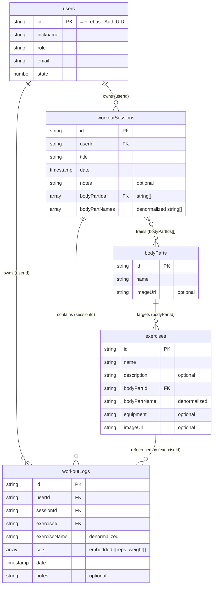

# Data Model

The app stores all data in Cloud Firestore. There are five top-level collections: two **shared** reference collections (`exercises`, `bodyParts`) and three **user-owned** collections (`users`, `workoutSessions`, `workoutLogs`) whose documents belong to a single user via the `userId` field (or, for `users`, the document ID itself).

TypeScript definitions for all shapes live in [`app/types/index.ts`](../app/types/index.ts).

## Entity-relationship diagram

## Collections

### `users` (user-owned)

One document per user, keyed by the **Firebase Auth UID** (no separate `userId` field).

| Field      | Type   | Notes                    |
| ---------- | ------ | ------------------------ |
| `nickname` | string |                          |
| `role`     | string |                          |
| `email`    | string |                          |
| `state`    | number |                          |

### `bodyParts` (shared)

Reference data for body parts (chest, back, legs, …).

| Field      | Type   | Notes    |
| ---------- | ------ | -------- |
| `name`     | string |          |
| `imageUrl` | string | optional |

### `exercises` (shared)

Exercise definitions, shared across all users.

| Field          | Type   | Notes                                  |
| -------------- | ------ | -------------------------------------- |
| `name`         | string |                                        |
| `description`  | string | optional                               |
| `bodyPartId`   | string | reference to `bodyParts`               |
| `bodyPartName` | string | **denormalized** copy of the body part |
| `equipment`    | string | optional, free text                    |
| `imageUrl`     | string | optional                               |

### `workoutSessions` (user-owned)

A training session on a given date.

| Field           | Type      | Notes                                     |
| --------------- | --------- | ----------------------------------------- |
| `userId`        | string    | owner (Firebase Auth UID)                 |
| `title`         | string    |                                            |
| `date`          | Timestamp |                                            |
| `notes`         | string    | optional                                   |
| `bodyPartIds`   | string[]  | references to `bodyParts` (many-to-many)   |
| `bodyPartNames` | string[]  | **denormalized** copies of body part names |

### `workoutLogs` (user-owned)

One document per exercise performed within a session. Sets are **embedded** in the document, not a subcollection.

| Field          | Type      | Notes                                            |
| -------------- | --------- | ------------------------------------------------ |
| `userId`       | string    | owner (Firebase Auth UID)                        |
| `sessionId`    | string    | parent `workoutSessions` document                |
| `exerciseId`   | string    | reference to `exercises`                         |
| `exerciseName` | string    | **denormalized** copy of the exercise name       |
| `sets`         | array     | `{ reps: number, weight: number }[]`             |
| `date`         | Timestamp | copied from the session date                     |
| `notes`        | string    | optional                                         |

Weight semantics: decimals are allowed (e.g. `2.5`), and **negative values mean assistance** (e.g. `-10` = 10 kg of machine assistance).

## Denormalization & consistency

Display names are denormalized onto referencing documents (`exerciseName` on logs, `bodyPartName`/`bodyPartNames` on exercises/sessions) to avoid extra reads. The trade-offs to be aware of:

- **Renames don't propagate** — renaming an exercise or body part leaves stale name copies on existing documents.
- **Deletes can orphan references** — deleting an exercise does not currently delete its `workoutLogs` (known issue); deleting a session *does* batch-delete its child logs.

## Dates

All dates are stored as Firestore `Timestamp` and converted with `.toDate()` to JavaScript `Date` in the composables when reading.

## Composite indexes

Defined in [`firestore.indexes.json`](../firestore.indexes.json):

| Collection        | Fields                                  | Used for                          |
| ----------------- | --------------------------------------- | --------------------------------- |
| `workoutSessions` | `userId` ASC, `date` DESC               | paginated session list            |
| `workoutLogs`     | `userId` ASC, `sessionId` ASC, `date` DESC | logs of a session               |
| `workoutLogs`     | `userId` ASC, `exerciseId` ASC, `date` DESC | exercise progress history      |
| `workoutLogs`     | `sessionId` ASC, `userId` ASC           | session log lookup / cascade delete |
